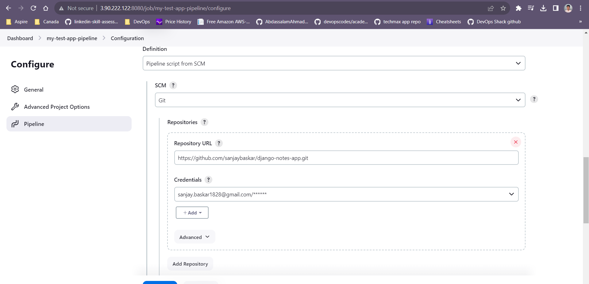

# Django Notes App

In this tutorial, we will guide you through the process of hosting a two-tier Flask application with a MySQL database using Docker Compose. This architecture allows you to separate your frontend (Flask application) from your backend (MySQL database) and deploy them together using containers. We assume you have a basic understanding of Git, Docker, and Python. Let's get started! 🚀

Step 1: Create a Linux EC2 machine with enabled ports 22, 8080, 8000 

Enabled inbound rules SSH - 22, Jenkins default port - 8080, App port - 8000

- connect the EC2 machine via ssh terminal

Commands I've used mentioned below:

sudo su -

sudo apt update

git clone https://github.com/sanjaybaskar/django-notes-app.git

cd ./django-notes-app/

Step 2 : Install docker 

sudo apt install git docker.io -y

- Add current user into the Docker group

sudo usermod -aG docker ubuntu

- check docker service is running or not

systemctl status docker

Step 3 : Install Java JDK and Jenkins Using Shell Script 

Make the Jenkins installation file as executable file

chmod +x jenkins-installation.sh

- Run the jenkins installation file 

./jenkins-installation.sh

- After Jenkins installation open the Jenkins into your browser 

IP address:8080

Open the jenkins using the inital admin password 

- Once the inital setup has been done Grant Jenkins access to build and run Docker images:

sudo usermod -aG docker jenkins

Step 5: Creating a Declarative Pipeline and enable the GitHub hook trigger for GITScm polling on Build triggers sections

Note: Do not forget to create a webhook on Github repository 

- Before running the job install Docker compose on Jenkins machine by using the below commands

sudo curl -L "https://github.com/docker/compose/releases/download/1.29.2/docker-compose-$(uname -s)-$(uname -m)" -o /usr/local/bin/docker-compose

sudo chmod +x /usr/local/bin/docker-compose

docker-compose --version

Step 6 : Run the Jenkins job

The job will executed succesfully then I have made some changes on the code and pushed into the repository the job will start automatically.

